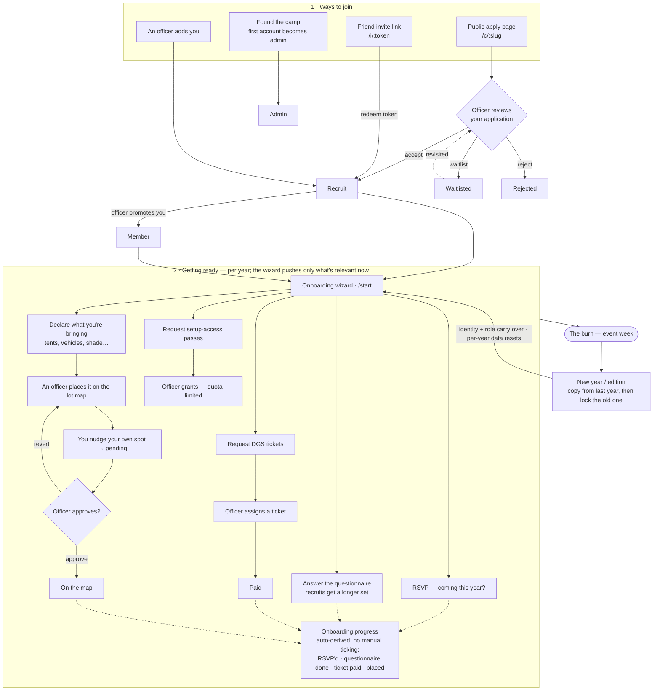

# Camp member lifecycle

How someone goes from "interested" to "on the playa" and back again next year.

This is a **design reference / source of truth for the model** — and the spec for
a future **in-app, member-visible onboarding overview** (see _Where this lives_
below). It is not the developer setup guide; that's the root [`README.md`](../README.md).

## The three concepts (and how they relate)

- **The wizard (`/start`) is the single member-facing driver.** It's season-aware:
  it surfaces only the asks that are in-season and relevant to this person right
  now (RSVP early, bringing/sharing as the event nears, etc.). Members rarely need
  the individual dashboard pages — those are the "advanced" way to do the same
  things.
- **Questions = a form you collect.** Officers _author_ the questionnaire on
  `/questions` (typed questions: text, yes/no, choice, date…); members _answer_ it
  through the wizard. Answers are **per-year** (they change each season).
- **Onboarding = auto-derived progress, not a manual checklist** _(target model)_.
  Each item flips to done when its real condition is met — an admin marks a ticket
  paid → the "ticket" item checks itself; you RSVP → the "RSVP" item checks itself.
  It's a read-out of state, not a separate to-do list to tick by hand.
- **Editions = the year loop.** Identity and camp role carry over; per-year data
  (RSVP, answers, bringing, tickets, passes, placement) resets each new edition.

## Where this lives (intent)

The end goal is to surface this lifecycle **in the app, visible to members** — a
"how camp works / where am I in the process" view that doubles as the onboarding
overview — rather than living only in this doc. This document is the spec for that
feature; the diagram above is what it should communicate.

## Status vs. target

- **Built today:** all four join paths; the season-aware wizard; questionnaire
  authoring + answering; bringing → place → pending-approval; ticket request →
  assign → paid; pass request → grant; per-year editions with copy-from + lock.
- **Target (not yet built):** onboarding progress **auto-derived** from state
  (currently the checklist is ticked manually); the **member-visible in-app**
  rendering of this whole flow.
